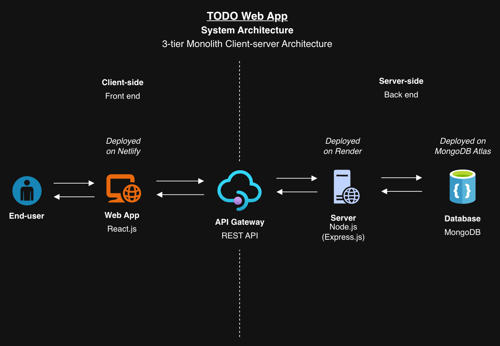
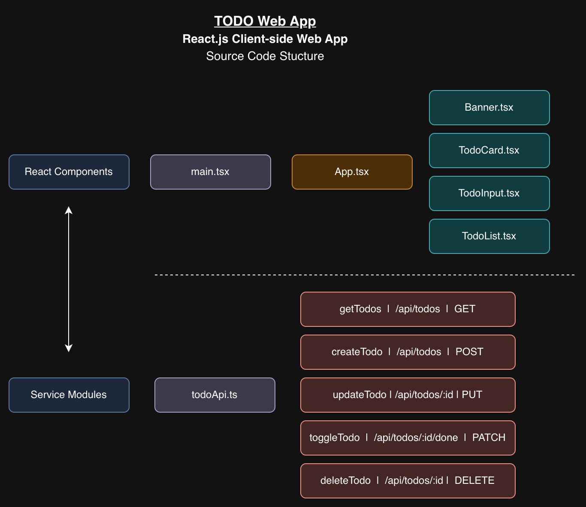
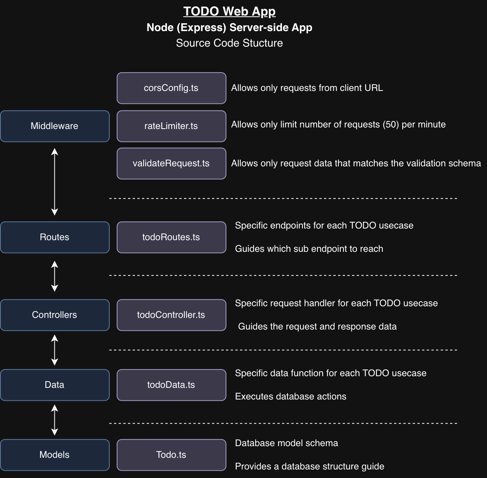

# TODO Web App

[](https://app.netlify.com/projects/lucaslhh-todo-web-app/deploys)</br>

https://todo-app-web-app.onrender.com</br>
</br>

## 1. Description

An 3-tier monolith client/server application based on a Node.js + Express + Mongoose API paired with a React + Vite UI for a Todo management application.
With full functionality across creating, editing, completing, and deleting TODOs.

1. **Add TODO** - Add new TODOs to your todo list.
2. **TODO List** - View your remaining TODOs and mark them as done.
3. **Edit / Delete** - Inline editing of existing TODOs and deletion functionality.

## 2. System Architecture

<p align="center">
  <kbd>
    
  </kbd>
</p>
<p align="center">Figure 2.1: System Architecture Diagram</p>

- **Frontend**: React (Vite), Tailwind CSS v4, TanStack Query (React Query), `react-hook-form`.
- **Backend**: Node.js, Express, Mongoose, `express-rate-limit` rate limiting, and `zod` schema validation.
- **Database**: MongoDB.

## 3. Installation

Requires Node 18+.

```bash
git clone <repo>
cd todo_app-web_app
```

Install dependencies for both the client and server:

```bash
cd Workspace/server
npm install
cd ../client
npm install
```

Copy the env examples and fill in real values (like your MongoDB URI):

```bash
# In Workspace/server
cp .env.example .env

# In Workspace/client
cp .env.example .env
```

Start the MongoDB database (via Docker Compose):

```bash
cd Workspace/server
docker-compose up -d
```

*(To stop the database, `docker-compose down`)*

Start the API Server:

```bash
npm run dev
```

Run the Client Web App:

```bash
cd Workspace/client
npm run dev    # http://localhost:5173
```

## 4. Usage

### 4.1. Non-functional Features

- **Security** -
    - Rate limit protection for all API endpoints using `express-rate-limit` with 50 requests per minute per IP address.
- **Input Validation** -
    - With frontend input forms are validated with `react-hook-form` and backend requests with `zon`.
    - In the backend request, every property in the request body is validated before touching the controller.
- **Backend Accessibility** -
    - The API is locked to one origin point by CORS, which is set to the frontend base URL.
- **Performance** -
    - Frontend data fetching and caching is optimised using TanStack Query (React Query).
- **UI Responsiveness** -
    - The UI components and Flexbox layouts can seamlessly handle several screen sizes from desktop to mobile.

### 4.2. Functional Features

- **Add TODO Item** -
    - Add new TODO item by providing a title and an optional description.
- **TODO Management** -
    - View a list of all TODOs.
    - Toggle TODOs between done and pending.
    - Inline editing of TODO titles and descriptions.
    - Confirmation before discarding unsaved edits or deleting a task.
- **Alerts** -
    - Animated slide-down banners alert the user to successful actions or errors.

## 5. Source Code Structure

### 5.1. Frontend (Client) Source Code -

<p align="center">
  <kbd>
    
  </kbd>
</p>
<p align="center">Figure 5.1.1: Client Source Code Structure</p>

The `src` directory contains the core frontend application code, structured as follows:

- **`main.tsx`**: The main entry point of the React application that renders `App.tsx` into the DOM.
- **`App.tsx`**: The main React component that acts as the root of the application, managing layouts and rendering other components.
- **`index.css`**: The global CSS file where Tailwind CSS directives and custom global styles are imported.
- **`components/`**: Contains reusable React UI components that make up the different parts of the application.
- **`services/`**: Contains API service functions for communicating with the backend server (for example, fetching, creating, updating, and deleting TODO items).
- **`types/`**: Contains TypeScript type definitions and interfaces used throughout the application to ensure type safety.

### 5.2. Backend (Server) Source Code -

<p align="center">
  <kbd>
    
  </kbd>
</p>
<p align="center">Figure 5.2.1: Server Source Code Structure</p>

The `src` directory contains the core application logic, structured as follows:

- **`index.ts`**: The main entry point of the server that initializes the Express application, applies middlewares, and registers routes.
- **`config/`**: Contains configuration files, such as the MongoDB connection setup.
- **`schemas/`**: Contains Zod validation schemas used to validate the structure and types of incoming request payloads.
- **`middlewares/`**: Contains custom Express middlewares, such as rate limiting, CORS configuration, and request data validation.
- **`routes/`**: Contains Express route definitions mapping endpoints to their respective controllers.
- **`controllers/`**: Contains the route handler functions that process incoming requests, interact with the database, and return responses.
- **`data/`**: Contains the database interaction functions.
- **`models/`**: Contains Mongoose schemas and models representing the database structure.

## 6. Potential Improvements

- **Authentication** -
    - The application currently doesn't have the ability to handle user accounts. But adding a JWT authentication will allow to handle multiple users to manage their own primary TODO lists.
- **Pagination** -
    - In the TODO list, all the TODOs are fetched at once. When the list grows, implementing pagination will reduce the loading time and database load.
- **Priority and Tag Catogorisation** -
    - Having the ability to mark TODOs with priority or grouping several TODOs under tag will allow the end-user to manage pending TODOs efficiently.
- **Test Coverage**-
    - Add unit tests, integration tests and E2E test (example with Playwright or Cypress) will ensure future enhancements won't break the system that was already working.

## 7. Credits

- The UI was created based on the following image, [Clean & Minimal Todo List Design](https://dribbble.com/shots/24425951-Clean-Minimal-Todo-List-Design)

## 8. License -
Copyright (c) 2026 H.V.L.Hasanka<br>
Licensed under [MIT License](LICENSE)
